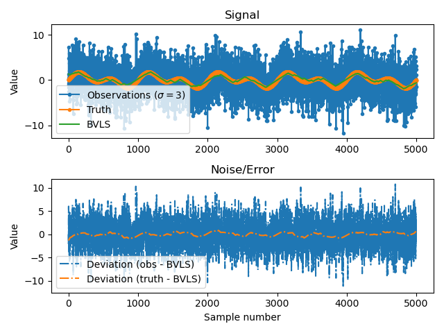

# Change-conscious Maximum Likelihood Estimation - CCMLE

This code contains a portable demo of our CCMLE algorithm [1] for obtaining maximum likelihood estimates of signals with _a priori_ known bounds on the relative change in the value at consecutive sampling times. The algorithm is based on a bounded variable least squares (BVLS) problem.

## Demo

We run CCMLE with a relative change bound of 0.01 on signal of 5000 samples constructed by the sum of two sinusoids, subject to zero-mean Gaussian noise with a standard deviation of 3. The results can be seen in the figure below.

For the noisy signal, the computed deviation was 3.05, whereas after CCMLE, the resulting signal had a computed standard deviation of 0.38.

## Dependencies

This could should run both in Python 2 and 3, although only Python 3 has been verified to run. In addition, the following dependencies are required:

- [`numpy`](https://numpy.org/)
- [`cvxpy`](https://www.cvxpy.org/)
- [`matplotlib`](https://matplotlib.org/) (only for plotting)

## Extensions

The same results can be obtained in a more efficient manner by using Dykstra's set projection algorithm. This code will be posted as a C++ package at a later date.

### References

[1] El-Kebir, H., & Ornik, M. (2020). In-flight Air Density Estimation and Prediction for Hypersonic Flight Vehicles. In _23rd AIAA International Space Planes and Hypersonic Systems and Technologies Conference_. https://doi.org/10.2514/6.2020-2412 [(open access)](https://hamza.el-kebir.info/blob/AIAA_SPHST20_In-flight_Air_Density_Estimation_and_Prediction_for_Hypersonic_Flight_Vehicles.pdf).